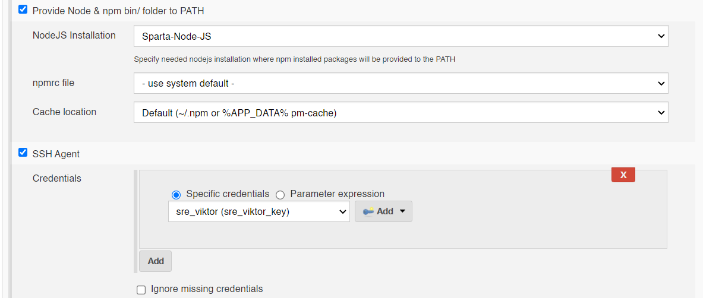
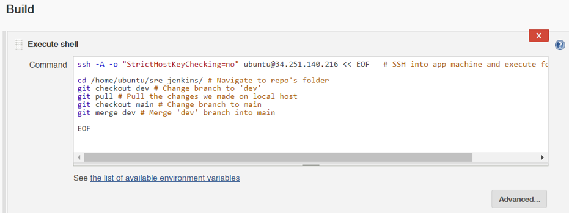
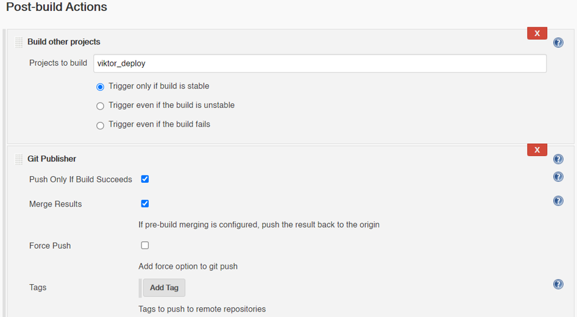
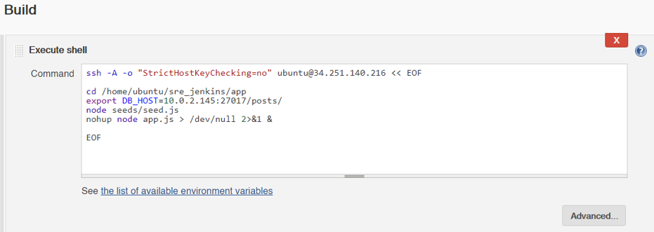

# Automation with Jenkins


## Step 1: Have the instances ready (app and db)
See previous repos: [Two-tier architecture](https://github.com/ViMitre/two-tier_architecture) and [AWS VPC Networking](https://github.com/ViMitre/aws_vpc_networking)
## Step 2: Setup SSH key on the repo
### 2.1: Generate SSH key on local system
Navigate to ~/.ssh and generate the key:<br>
`ssh-keygen -t rsa -b 4096 -C "your_email@example.com"`
### 2.2: Deploy the key on the GitHub repo
#### On the repo's page, go to **Settings --> Deploy keys --> Add deploy key**
#### Name it as you like, and insert the generated **`public key`**
## Step 3: Create webhook on github
### On the repo's page, go to **Settings --> Webhooks --> Add webhook**
**Payload URL**: `http://IP:8080/github-webhook/`<br>
**Events to trigger:** `Just the push event`
## Step 4: Create jobs on Jenkins
### 4.1: **Test**
4.1.1 Select 'GitHub project' under 'General' and add the repo for the Project URL: https://github.com/ViMitre/sre_jenkins.git/<br>
4.1.2 Under Office 365 Connector, select 'Restrict where this project can be run' and add `sparta-ubuntu-node` for Label Expression<br>
4.1.3 Under 'Source Code Management' select 'Git', add the SSH address of the repo: `git@github.com:ViMitre/sre_jenkins.git`<br>
For credentials, add the private key generated for Jenkins<br>
4.1.4 Under 'Build Triggers', tick `GitHub hook trigger for GITScm polling`<br>
4.1.5 Add the following settings under 'Build Environment':

*For credentials, add the 'sre_key.pem key*<br>
4.1.6 Under '**Build**', add a build step and select '**Execute shell**' <br>
Add the following commands:
```
cd app
npm install
npm test
```

Add a post-build action and select **'Build other projects'**, for projects to build add the next job.

### 4.2: **Merge Git repo**
#### **Use settings of the previous job**
Untick `GitHub hook trigger for GITScm polling`, since this job will be triggered by the previous job if successful, not by the webhook.<br>
#### **Add this build step (execute shell):**

```
ssh -A -o "StrictHostKeyChecking=no" ubuntu@34.251.140.216 << EOF

cd /home/ubuntu/sre_jenkins/
git checkout dev
git pull
git checkout main
git merge dev

EOF
```
#### **Add the following post-build action:**

*The name of project is the following job*

### 4.3: **Deploy**
#### **Use settings of the previous job**
#### **Add the following build step (execute shell):**

```
ssh -A -o "StrictHostKeyChecking=no" ubuntu@34.251.140.216 << EOF	

cd /home/ubuntu/sre_jenkins/app
export DB_HOST=10.0.2.145:27017/posts/
node seeds/seed.js
nohup node app.js > /dev/null 2>&1 &

EOF
```
