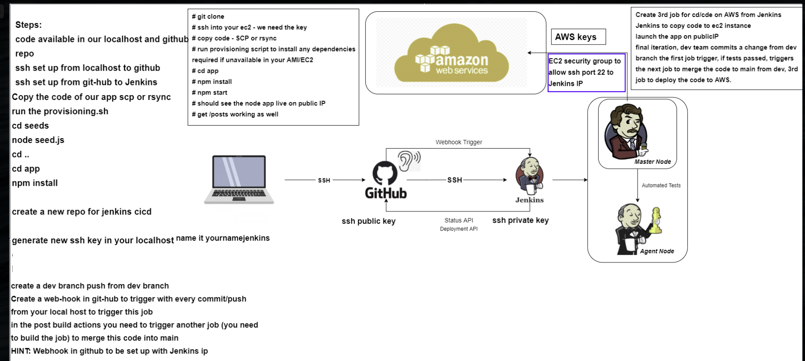

# Automation with Jenkins

## Step 1: Have the instances ready (app and db)
## Step 2: Setup SSH key on the repo
### 2.1: Generate SSH key on local system
### 2.2: Deploy the key on the GitHub repo
## Step 3: Create webhook on github
## Step 4: Create jobs on Jenkins
### 4.1: **Test**
4.1.1 Select 'GitHub project' under 'General' and add the repo for the Project URL: https://github.com/ViMitre/sre_jenkins.git/<br>
4.1.2 Under Office 365 Connector, select 'Restrict where this project can be run' and add `sparta-ubuntu-node` for Label Expression<br>
4.1.3 Under 'Source Code Management' select 'Git', add the SSH address of the repo: `git@github.com:ViMitre/sre_jenkins.git`<br>
For credentials, add the private key generated for Jenkins<br>
4.1.4 Under 'Build Triggers', tick `GitHub hook trigger for GITScm polling`<br>
4.1.5 Add the following settings under 'Build Environment':

4.1.6 Under '**Build**', add a build step and select '**Execute shell**' <br>
Add the following commands:
```
cd app
npm install
npm test
```
### **Once the second job is ready:**
Add a post-build action and select **'Build other projects'**, for projects to build add the next job.

### 4.2: **Github**
Untick `GitHub hook trigger for GITScm polling`, since this job will be triggered by the previous job, not the webhook.<br>
#### **Method A:**
```
ssh -A -o "StrictHostKeyChecking=no" ubuntu@34.251.140.216 << EOF	# SSH into app machine and execute following commands

cd /home/ubuntu/sre_jenkins/ # Navigate to repo's folder
git checkout dev # Change branch to 'dev'
git pull # Pull the changes we made on local host
git checkout main # Change branch to main
git merge dev # Merge 'dev' branch into main

EOF
```
#### **Method B:**

### 4.3: **Deploy**
```
ssh -A -o "StrictHostKeyChecking=no" ubuntu@34.251.140.216 << EOF	

cd /home/ubuntu/sre_jenkins/app
export DB_HOST=10.0.2.145:27017/posts/
node seeds/seed.js
nohup node app.js > /dev/null 2>&1 &

EOF
```